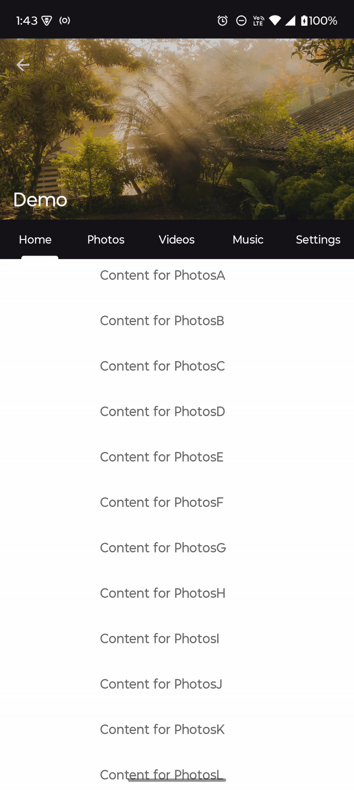

# Android CoordinatorTabLayout – Collapsing Header + Tabs

[](https://kotlinlang.org/)
[](https://developer.android.com/about/versions/lollipop)
[](https://material.io/develop/android)
[](https://opensource.org/licenses/MIT)
[](#)

**Android CoordinatorTabLayout** is a powerful and flexible custom UI component that combines:

- `CoordinatorLayout`
- `AppBarLayout`
- `CollapsingToolbarLayout`
- `Toolbar`
- `TabLayout`
- `ViewPager`

into **one reusable, clean, and highly customizable view**.

It allows you to build **modern collapsing header screens with tabs** (similar to Google Play, YouTube, etc.) using **minimal setup** and a **fluent API**.

---

## 📸 Preview

<div align="center">
  
</div>

---

## ✨ Features

- Collapsing image header with smooth parallax animation
- Integrated `Toolbar` with back button support
- Transparent AppBar & TabLayout (no black overlays)
- Dynamic header image per tab
- Dynamic scrim color per tab
- Fully customizable TabLayout (text color, indicator, size)
- Supports edge-to-edge layouts
- Works with `ViewPager`
- Clean fluent API
- Library-safe (no Material version crashes)
- Zero magic – fully extensible

---

## 📦 Installation

### Step 1: Add JitPack repository

In **settings.gradle** or root **build.gradle**:

```gradle
repositories {
    maven { url 'https://jitpack.io' }
}
````

### Step 2: Add dependency

```gradle
dependencies {
    implementation("com.github.YourUsername:Android_CoordinatorTabLayout:1.0.0")
}
```

---

## 🚀 Basic Usage

### Step 1: Add `CoordinatorTabLayout` in XML

```xml
<com.ext.coordinator_tablayout.CoordinatorTabLayout
    android:id="@+id/coordinatorTabLayout"
    android:layout_width="match_parent"
    android:layout_height="match_parent"
    android:fitsSystemWindows="true"

    app:tabIndicatorColor="@android:color/white"
    app:tabIndicatorHeight="4dp"
    app:tabTextColor="#CCFFFFFF"
    app:tabSelectedTextColor="@android:color/white"
    app:expandedTitleColor="@android:color/white"
    app:collapsedTitleColor="@android:color/white"
    app:contentScrimColor="@android:color/transparent" />
```

---

### Step 2: Setup in Activity

```kotlin
class MainActivity : AppCompatActivity() {

    private lateinit var coordinatorTabLayout: CoordinatorTabLayout

    override fun onCreate(savedInstanceState: Bundle?) {
        super.onCreate(savedInstanceState)

        setContentView(R.layout.activity_main)

        coordinatorTabLayout = findViewById(R.id.coordinatorTabLayout)

        val titles = arrayOf("Home", "Photos", "Videos", "Music")

        val adapter = SamplePagerAdapter(
            supportFragmentManager,
            titles
        )

        val images = intArrayOf(
            R.drawable.header_1,
            R.drawable.header_2,
            R.drawable.header_3,
            R.drawable.header_4
        )

        val colors = intArrayOf(
            Color.parseColor("#2196F3"),
            Color.parseColor("#4CAF50"),
            Color.parseColor("#FF5722"),
            Color.parseColor("#9C27B0")
        )

        setSupportActionBar(coordinatorTabLayout.getToolbar())
        supportActionBar?.setDisplayHomeAsUpEnabled(true)

        coordinatorTabLayout
            .setupWithViewPager(adapter)
            .setImageArray(images)
            .setColorArray(colors)
            .setTitle("Demo")
            .setTabIndicatorColor(Color.WHITE)
            .setTabIndicatorHeight(4)
            .setTabTextColors(Color.WHITE, Color.WHITE)
            .setExpandedTitleColor(Color.WHITE)
            .setCollapsedTitleColor(Color.WHITE)
            .setTabTextSize(14f)
    }
}
```

---

## 🎨 XML Attributes

| Attribute              | Description                   |
| ---------------------- | ----------------------------- |
| `tabIndicatorColor`    | Color of tab indicator        |
| `tabIndicatorHeight`   | Height of tab indicator       |
| `tabTextColor`         | Default tab text color        |
| `tabSelectedTextColor` | Selected tab text color       |
| `tabTextSize`          | Tab text size                 |
| `contentScrimColor`    | CollapsingToolbar scrim color |
| `expandedTitleColor`   | Title color when expanded     |
| `collapsedTitleColor`  | Title color when collapsed    |
| `toolbarHeight`        | Custom toolbar height         |

---

## 🧩 Public API Methods

### Setup

```kotlin
setupWithViewPager(adapter)
```

### Header

```kotlin
setImageArray(images)
setColorArray(colors)
```

### Title

```kotlin
setTitle("Demo")
setExpandedTitleColor(color)
setCollapsedTitleColor(color)
```

### Tabs

```kotlin
setTabIndicatorColor(color)
setTabIndicatorHeight(height)
setTabTextColors(normal, selected)
setTabTextSize(sizeSp)
setTabPadding(dp)
```

### Listeners

```kotlin
setOnImageLoadListener { imageView, resId -> }
setOnTabSelectedListener { position -> }
```

### Access Views

```kotlin
getToolbar()
getTabLayout()
getViewPager()
getCollapsingToolbar()
getHeaderImageView()
getAppBarLayout()
```

---

## 🖼 Custom Image Loading (Glide / Picasso)

```kotlin
coordinatorTabLayout.setOnImageLoadListener { imageView, imageRes ->
    Glide.with(this)
        .load(imageRes)
        .into(imageView)
}
```

---

## 📄 License

```
MIT License

Copyright (c) 2025 Excelsior Technologies

Permission is hereby granted, free of charge, to any person obtaining a copy
of this software and associated documentation files (the "Software"), to deal
in the Software without restriction, including without limitation the rights
to use, copy, modify, merge, publish, distribute, sublicense, and/or sell
copies of the Software, and to permit persons to whom the Software is
furnished to do so, subject to the following conditions:

The above copyright notice and this permission notice shall be included in all
copies or substantial portions of the Software.

THE SOFTWARE IS PROVIDED "AS IS", WITHOUT WARRANTY OF ANY KIND.
```

---

